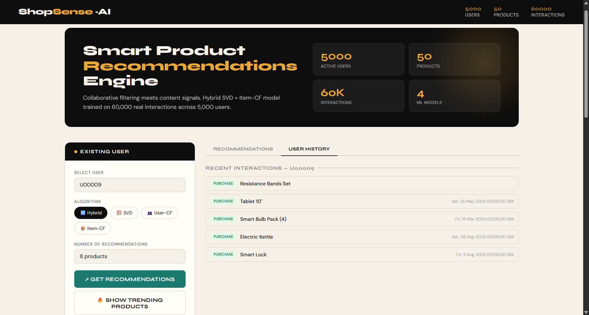
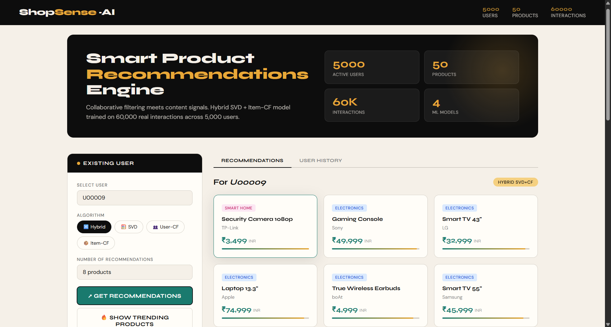
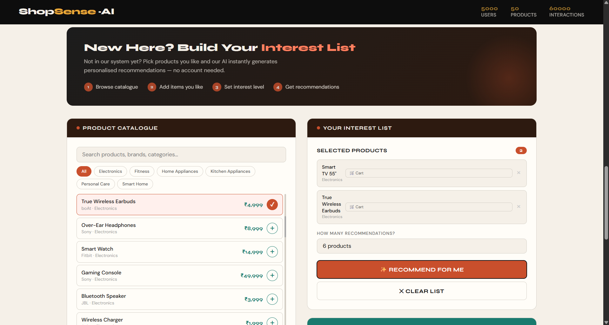

# ShopSenseAI

ShopSenseAI is a Flask-based product recommendation web app that combines collaborative filtering, content-based similarity, and popularity fallback in one project.

It includes:
- Personalized recommendations for known users.
- Cold-start recommendations for guest users based on selected products.
- Similar product lookup.
- Model evaluation endpoint using a temporal split.
- Single-page UI for exploring all flows.

## Features

- `SVD` matrix factorization recommender.
- `User-Based CF` recommender using user-user cosine similarity.
- `Item-Based CF` recommender using item-item cosine similarity.
- `Hybrid` recommender that blends SVD and Item-CF scores.
- `Content-Based` similar-item lookup using category, brand, and normalized price.
- `Trending` model using weighted interactions from recent 90-day activity.
- Guest cold-start recommendations from a product basket plus interaction intent.
- Evaluation pipeline with Precision@5 on a temporal 80/20 split.

## Output

### 1) User History


### 2) Existing User


### 3) New User Input


### 4) New User Input Recommendation


## Tech Stack

- Python
- Flask
- pandas
- numpy
- scikit-learn
- scipy
- HTML/CSS/Vanilla JavaScript

## Project Structure

```text
ShopSenseAI/
|-- app.py
|-- recommender.py
|-- requirements.txt
|-- README.md
|-- data/
|   `-- product_recommendation_dataset_v2.csv
|-- templates/
|   `-- index.html
|-- __pycache__/
`-- {templates,static/   (extra malformed folder present in this workspace)
```

Main files:
- `app.py`: Flask app and API routes.
- `recommender.py`: preprocessing, model training, recommendation logic, and evaluation.
- `templates/index.html`: frontend UI for user and guest recommendation flows.

## How It Works

1. Load and clean interaction data.
2. Build engagement score per interaction.
3. Aggregate to a user-item matrix.
4. Train all recommendation models.
5. Serve predictions through Flask APIs.

Engagement score formula used in `recommender.py`:

```text
engagement_score = interaction_score
                 + 0.5 * rating
                 + 0.3 * (purchase * scroll_depth_pct / 100)
                 - 1.5 * returned
```

Interaction weights:
- `view`: 1
- `wishlist`: 2
- `add_to_cart`: 3
- `purchase`: 5

## Setup

### 1. Clone and enter project

```bash
git clone <your-repo-url>
cd ShopSenseAI
```

### 2. Create and activate virtual environment (recommended)

Windows PowerShell:

```powershell
python -m venv .venv
.\.venv\Scripts\Activate.ps1
```

### 3. Install dependencies

```bash
pip install -r requirements.txt
```

### 4. Verify dataset path

Make sure this file exists:

```text
data/product_recommendation_dataset_v2.csv
```

### 5. Run the app

```bash
python app.py
```

Open:

```text
http://localhost:5000
```

## API Reference

### `GET /`

Renders the main dashboard page.

### `GET /api/recommend`

Get recommendations for an existing user.

Query params:
- `user_id` (required)
- `algo` (optional): `hybrid` (default), `svd`, `user_cf`, `item_cf`
- `top_n` (optional, default `6`)

Example:

```text
/api/recommend?user_id=U00192&algo=hybrid&top_n=6
```

Returns:
- requested `user_id`
- algorithm name
- `recommendations` list
- recent `history` list

### `GET /api/similar`

Get similar items for a product using content features.

Query params:
- `product_id` (required)
- `top_n` (optional, default `5`)

Example:

```text
/api/similar?product_id=P101&top_n=5
```

### `GET /api/trending`

Get trending products from recent weighted interactions.

Query params:
- `top_n` (optional, default `6`)

### `GET /api/evaluate`

Run evaluation across SVD, User-CF, and Item-CF.

Returns:
- per-model `precision_at_5`
- model descriptions
- `_meta` info with split cutoff, test users, and sampling details

### `GET /api/stats`

Returns dataset stats:
- total users
- total products
- total interactions
- category list
- interaction breakdown

### `GET /api/history/<user_id>`

Get recent interaction history for a specific user.

### `POST /api/guest_recommend`

Generate recommendations for guest users with no profile.

Request body:

```json
{
  "products": [
    {"product_id": "P101", "interaction": "view"},
    {"product_id": "P204", "interaction": "add_to_cart"}
  ],
  "top_n": 6
}
```

Response includes:
- `recommendations`
- `valid_seeds`
- `method` (`item_cf_cold_start` or `trending_fallback`)

### `GET /api/catalogue`

Returns product catalogue used by the guest picker in the UI.

## Frontend Overview

The page in `templates/index.html` contains:
- Existing user recommendation panel.
- Similar product search panel.
- Evaluation panel.
- Tabbed recommendation/history output.
- Guest recommendation workflow:
  - catalogue search and category filters
  - interest basket
  - interaction-type selector per basket item
  - cold-start recommendations with "because_of" explanation

## Common Issues

- `FileNotFoundError` on startup:
  - Confirm `data/product_recommendation_dataset_v2.csv` exists.
- Empty recommendations for user:
  - User may be unknown or sparse; app falls back to trending.
- Slow first load:
  - Models are trained at app startup, so first run takes longer.

## Notes

- App currently runs with `debug=True` in `app.py`.
- Recommendation engine is initialized once at startup and reused per request.
